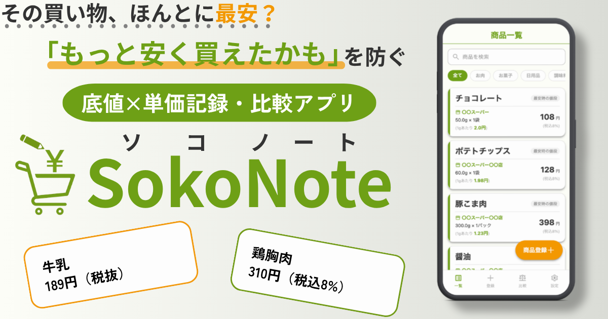

## SokoNote ソコノート
### 「もっと安く買えたかも」を防ぐ底値×単価記録アプリ
サービスURL：https://www.sokonote.com/
<p align="center">
  
</p>

## サービス概要
本サービスは、日々の食材や日用品の買い物において「以前より高く買ってしまう」失敗を防ぐための、底値管理・比較Webアプリです。

ユーザーは商品ごとに**過去の購入価格を登録・保存**でき、再度購入する際に現在価格と履歴データを**即座に比較**することができます。

また、内容量やパック数が異なる**同一商品の単価を自動計算**し、どちらの商品が最もお得か**迷わず判断**できます。

## 開発背景
私は買い物と節約が好きで、スーパーごとの価格や特徴を比較し、少しでも安く購入できたときに喜びを感じてきました。

しかしその一方で、

「別の店の方が安かった」

「以前はもっと安く買えた」

と後から気づく経験も多くありました。

日常の買い物では、同じ商品であっても店舗・時期・内容量によって価格が変動します。

そのため、どの店舗でどの量をいくらで購入したのかを記憶に頼って判断していましたが、

情報量が多く、人の記憶だけでは正確な比較に限界がありました。

そこで、過去の購入価格や内容量を商品ごとにデータとして蓄積し、現在の価格と自動的に比較することで、感覚ではなく根拠を持って価格判断ができる仕組みが必要だと考えました。

人が記憶や計算を行うのではなく、アプリ側が単価計算や底値比較を行うことで、買い物中でも迷わず意思決定できることを目指しています。

## ターゲット層&理由
### メインターゲットユーザー
  **20代後半〜40代　共働きの主婦（主夫）層**

  - 週2〜3回は買い物をする
  - 節約意識があり、少しでも安く買いたいと考えている
  - チラシをよく見る習慣がある
  - スマートフォンでの情報管理は抵抗がない
  
  **選定理由**
  
  日常的に価格変動を体感しており、家族構成によるが購入量が多く、単価比較の効果を実感しやすい。

  また、共働きで時間が限られているため初回利用時は商品登録が必要ですが、一度登録すれば次回以降は即座に比較できるため、買い物中の素早い判断できるというニーズに着目しました。

# サービス利用のイメージ

| トップページ | 商品一覧 | 商品登録 |
|:---:|:---:|:---:|
|  |  |  |
| メールアドレス・LINEで会員登録・ログインができます | 登録した商品を一覧で確認することができます | 購入した商品を登録することができます |

| 商品詳細登録 | 購入履歴一覧 | 同一単価比較 |
|:---:|:---:|:---:|
|  |  |  |
| 商品登録後、さらに細かい内容を登録できます | 商品の購入した履歴を確認できます | 同一商品でどちらが安いか即判断できます |

## サービスの差別化ポイント

| 既存サービス | 課題 |
|------|------|
| メモアプリ | 情報を自由に記録できる一方で、構造化されていないため検索や計算が難しい。結果として単価を出すには別途手動で行う必要がある |
| 家計簿アプリ | 「いくら使ったか（過去）」の記録が目的であり、「今買うべきか（未来）」の判断材料は限定的。<br>レシートOCR機能（文字をデジタルに変換する技術）が搭載されたアプリもあるが、内容量や単価まで考慮した比較は難しい |
| 「どちらがお得」スマホアプリ | その場でAとBの比較は可能だが、自分の過去の購入価格や最安値を基準とした比較は行えない |
| 「ソコネ」スマホアプリ | 過去の底値を記録し、次回購入時の参考情報として活用できる一方で、買い物中に同一商品の内容量違いを単価ベースで即比較する機能は限定的 |

本アプリはこれらの課題に対して、以下の点で差別化しています。

- **自分が過去に購入した価格を基準とした比較**
- **内容量の異なる商品でも単価を即座に自動計算**
<br>→ 今、目の前にあるA商品とB商品のどちらを買うべきか、かつ、それは自分の過去の底値と比べてどうなのかという過去の商品×目の前の商品を同時に行う
- **検索フォームにより即座に探したい商品を閲覧可能**
  
単なる比較ツールだけではなく、日常的な節約行動を変える体験設計を重視している点が本サービスの特徴です。

## 機能紹介
### 実装済み機能

- ユーザー認証機能（メールアドレスorLINEログイン）
 - パスワードリセット機能
- 商品一覧・編集・削除機能
- 購入履歴一覧・編集・削除機能
- マスタ機能（カテゴリー・店舗・単位（内容量））
- 同一商品比較機能
- 検索・フィルタリング機能
- スマートフォン使用を想定したレスポンシブデザイン

### 今後の実装予定の機能

- **ユーザーの意見を取り入れつつ継続的なアップデート**
- 買い物リスト機能
- Vision APIを用いたチラシ読み取り機能
- LINE messageAPIによる通知機能
- 複数単位（1g→100g）での単価表示切り替え表示機能
- 家族間共有機能
- ハンバーガーメニュ機能

## 技術スタック

| 分類 | 使用技術 |
|-|-|
| 開発環境 | Docker（docker-compose） |
| フロントエンド | Hotwire（Turbo / Stimulus）, Tailwind CSS |
| バックエンド | Ruby 3.4.8 Ruby on Rails 7.2.3 |
| データベース | PostgreSQL（Neon） |
| デプロイ | Render |
| 認証 | Devise, LINE Login v2.1 API |
| CI/CD | GitHub Actions（Breakman, Rubocop, RSpec）, CodeRabbit |
| メール送信 | Resend |
| 監視 | Sentry, UptimeRobot |

# 画面遷移図
[Figma：画面遷移図](https://www.figma.com/design/2nRhzOQEsA78fdodbD6kym/%E5%8D%92%E6%A5%AD%E5%88%B6%E4%BD%9C_%E7%94%BB%E9%9D%A2%E9%81%B7%E7%A7%BB%E5%9B%B3?node-id=127-2208&t=o3Y9NkUTTp4F2Rtg-1)

# ER図
```mermaid
erDiagram
  users ||--o{ categories : "1人のユーザーは0以上の自分用のカテゴリを持つ"
  users ||--o{ items : "1人のユーザーは0以上の自分用の商品を持つ" 
  users ||--o{ stores :  "1人のユーザーは0以上の自分用の店舗を持つ"
  users ||--o{ purchases : "1人のユーザーは0以上の自分の購入履歴を持つ"
  users ||--o{ content_units : "1人のユーザーは0以上の自分用の内容量単位を持つ"
  users ||--o{ package_units : "1人のユーザーは0以上の自分用の包装単位を持つ"
  categories ||--o{ items : "1つのカテゴリは0以上の商品をもつ"
  items ||--o{ purchases : "1つの商品は0以上の購入履歴を持つ" 
  stores||--o{ purchases : "1つの店舗は0以上の購入履歴を持つ"
  content_units||--o{ purchases : "1つの内容量単位は0以上の購入履歴を持つ"
  package_units||--o{ purchases : "1つの包装単位は0以上の購入履歴を持つ"

  users {
    bigint id PK "ユーザーID（主キー）"
    string name "ニックネーム"
    string email "メールアドレス"
    string provider "外部ログインサービス名（LINEなど）"
    string uid "外部ログインサービス側のユーザー識別ID"
    string encrypted_password "ログイン用パスワード"
    string reset_password_token "パスワード再設定用トークン"
    datetime reset_password_sent_at "パスワード再設定メール送信日時"
    datetime remember_created_at "ログイン状態保持開始日時"
    datetime created_at "作成日時"
    datetime updated_at "更新日時"
  }

  items {
    bigint id PK "商品ID（主キー）"
    bigint user_id FK "ユーザーID（外部キー）"
    bigint category_id FK "カテゴリID（外部キー・任意）"
    string name "商品名"
    datetime created_at "作成日時"
    datetime updated_at "更新日時"
  }

  purchases {
    bigint id PK "購入履歴ID（主キー）"
    bigint user_id FK "ユーザーID（外部キー）"
    bigint item_id FK "商品ID（外部キー）"
    bigint store_id FK "店舗ID（外部キー・任意）"
    bigint content_unit_id FK "内容量単位ID（外部キー）"
    bigint package_unit_id FK "包装単位ID（外部キー・任意）"
    string brand "ブランド名"
    decimal content_quantity "内容量"
    integer package_quantity "パック数"
    integer price "価格"
    decimal unit_price "計算後の単価"
    integer tax_rate "消費税"
    date purchased_on "購入日"
    datetime created_at "作成日時"
    datetime updated_at "更新日時"
  }

  stores {
    bigint id PK "店舗ID（主キー）"
    bigint user_id FK "ユーザーID（外部キー）"
    string name "店舗名"
    datetime created_at "作成日時"
    datetime updated_at "更新日時"    
  }

  categories {
    bigint id PK "カテゴリID（主キー）"
    bigint user_id FK "ユーザーID（外部キー）"
    string name "カテゴリ名"
    datetime created_at "作成日時"
    datetime updated_at "更新日時"
  }

  content_units {
    bigint id PK "内容量単位ID（主キー）"
    bigint user_id FK "ユーザーID（外部キー）"
    string name "内容量単位名"
    datetime created_at "作成日時"
    datetime updated_at "更新日時"
  }

  package_units {
    bigint id PK "包装単位ID（主キー）"
    bigint user_id FK "ユーザーID（外部キー）"
    string name "包装単位名"
    datetime created_at "作成日時"
    datetime updated_at "更新日時"
  }

